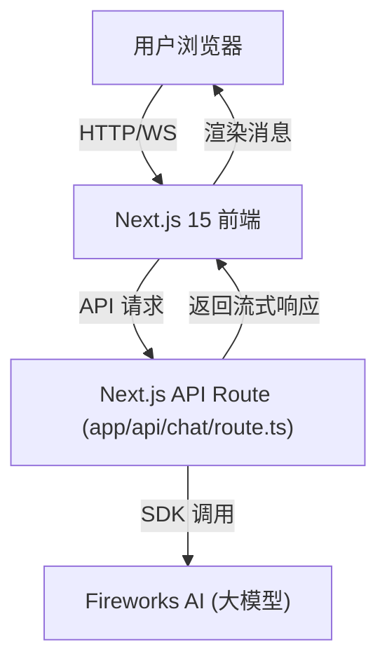

# 用 AI SDK 5 和 Next.js 15 开发 AI Chatbot —— 项目实践与技术解析

## 项目简介

本项目是一个基于 **Next.js 15** 和 **AI SDK 5**（结合 Fireworks AI 服务）的智能聊天机器人 demo，旨在演示如何用现代 web 技术和 AI 能力快速搭建一个高可用、可扩展的 AI 聊天应用。

- 在线体验现代化 UI
- 支持流式 AI 对话
- 代码结构清晰，易于二次开发

---

## 1. 技术选型与架构

### 1.1 技术栈

- **前端框架**：Next.js 15（App Router 架构）
- **AI SDK**：Vercel AI SDK 5（ai@5.x），Fireworks AI 作为大模型服务
- **UI 组件**：Radix UI + Tailwind CSS
- **类型系统**：TypeScript
- **状态管理**：React Hooks（useChat）
- **部署**：Vercel 一键部署

### 1.2 架构总览



---

## 2. 开发流程与核心实现

### 2.1 环境准备

1. 克隆项目并安装依赖
2. 配置 `.env.local`，填入 Fireworks API Key
3. 本地开发：`npm run dev`

### 2.2 关键目录结构

```
ai-chatbot-nextjs/
├─ app/                # Next.js App Router
│  ├─ api/chat/        # 聊天 API
│  ├─ layout.tsx       # 全局布局
│  └─ page.tsx         # 首页
├─ components/         # 前端组件
│  ├─ ChatInterface.tsx# 聊天主界面
│  ├─ ChatInput.tsx    # 输入框
│  └─ ChatMessage.tsx  # 消息气泡
├─ hooks/              # 自定义 Hooks
├─ lib/                # 工具库
├─ public/             # 静态资源
└─ ...                 # 其他配置
```

---

## 3. 核心技术点

### 3.1 AI SDK 5 核心 API

#### 3.1.1 AI SDK 的核心优势

**🎯 统一的多模型提供商 API**

AI SDK 最大的优势之一就是**统一了各大模型提供商的 API**，开发者不再需要针对不同的模型提供商编写不同的 API 调用方式。无论是 OpenAI、Anthropic、Google 等众多大型的模型提供商，还是其他小型的模型提供商（如 Fireworks、Luma、Hume...），还是 Community Providers （如 Qwen、Ollama...）或 开发者自定义的 model providers，都使用同一套 API 调用方式：

```ts
// 统一的 API 格式，支持多种模型提供商
import { createFireworks } from '@ai-sdk/fireworks'
import { createOpenAI } from '@ai-sdk/openai'
import { createAnthropic } from '@ai-sdk/anthropic'
import { streamText } from 'ai'

// Fireworks AI
const fireworks = createFireworks({ apiKey: process.env.FIREWORKS_API_KEY })
const fireworksModel = fireworks('accounts/fireworks/models/llama-v3p1-70b-instruct')

// OpenAI
const openai = createOpenAI({ apiKey: process.env.OPENAI_API_KEY })
const openaiModel = openai('gpt-4')

// Anthropic
const anthropic = createAnthropic({ apiKey: process.env.ANTHROPIC_API_KEY })
const anthropicModel = anthropic('claude-3-sonnet-20240229')

// 统一的调用方式
const result = streamText({
  model: fireworksModel, // 或 openaiModel 或 anthropicModel
  messages: convertToModelMessages(messages),
  temperature: 0.7,
  maxTokens: 1000
})
```

**🚀 无缝切换模型提供商**

只需更改模型实例，即可在不同提供商之间无缝切换：

```ts
// 从 Fireworks 切换到 OpenAI
const model = process.env.USE_OPENAI === 'true' 
  ? openai('gpt-4') 
  : fireworks('accounts/fireworks/models/llama-v3p1-70b-instruct')

// 代码无需任何修改，直接使用
const result = streamText({
  model,
  messages: convertToModelMessages(messages),
  temperature: 0.7
})
```

**🔧 统一的参数格式**

所有模型提供商都使用相同的参数格式：

```ts
// 统一的参数格式，适用于所有模型提供商
const result = streamText({
  model,
  messages: convertToModelMessages(messages),
  temperature: 0.7,        // 所有模型都支持
  maxTokens: 1000,         // 所有模型都支持
  topP: 0.9,              // 所有模型都支持
  frequencyPenalty: 0.1,   // 所有模型都支持
  presencePenalty: 0.1     // 所有模型都支持
})
```

**📦 插件化架构**

AI SDK 5 采用插件化架构，支持轻松添加新的模型提供商：

```ts
// 自定义模型提供商
import { createProvider } from '@ai-sdk/core'

const customProvider = createProvider({
  id: 'custom-provider',
  generateText: async (params) => {
    // 自定义实现
    return { text: 'Custom response' }
  }
})

const customModel = customProvider('custom-model')
```

**🔄 统一的流式响应**

所有模型提供商都支持统一的流式响应格式：

```ts
// 统一的流式响应处理
const result = streamText({
  model: anyProviderModel, // 任何提供商模型
  messages: convertToModelMessages(messages)
})

// 统一的返回格式
return result.toUIMessageStreamResponse()
```

#### 3.1.2 后端核心 API

**1. `createFireworks()` - 创建 AI 模型实例**
```ts
import { createFireworks } from '@ai-sdk/fireworks'

const fireworks = createFireworks({ 
  apiKey: process.env.FIREWORKS_API_KEY 
})
const model = fireworks('accounts/fireworks/models/llama-v3p1-70b-instruct')
```

**2. `streamText()` - 流式文本生成**
```ts
import { streamText, convertToModelMessages } from 'ai'

const result = streamText({
  model,
  messages: convertToModelMessages(messages), // 转换消息格式
  temperature: 0.7,                          // 控制创造性 (0-1)
  maxTokens: 1000,                           // 最大输出长度
  topP: 0.9,                                // 核采样参数
  frequencyPenalty: 0.1,                     // 频率惩罚
  presencePenalty: 0.1                       // 存在惩罚
})
```

**3. `toUIMessageStreamResponse()` - 转换为 UI 消息流**
```ts
// 返回标准的 Server-Sent Events 流
return result.toUIMessageStreamResponse()
```

**4. `convertToModelMessages()` - 消息格式转换**
```ts
// 将 UI 消息转换为模型可理解的格式
const modelMessages = convertToModelMessages([
  { role: 'user', content: 'Hello' },
  { role: 'assistant', content: 'Hi there!' }
])
```

#### 3.1.2 前端核心 API

**1. `useChat()` - 聊天状态管理 Hook**
```tsx
import { useChat } from '@ai-sdk/react'

const {
  messages,           // 消息列表
  sendMessage,        // 发送消息函数
  status,            // 状态：'idle' | 'streaming' | 'error'
  stop,              // 停止生成
  setMessages,       // 设置消息列表
  reload,            // 重新加载最后一条消息
  isLoading,         // 是否正在加载
  error              // 错误信息
} = useChat({
  api: '/api/chat',           // API 端点
  onError: (error) => {       // 错误处理
    console.error('Chat error:', error)
  },
  onFinish: (message) => {    // 完成回调
    console.log('Chat finished:', message)
  },
  onResponse: (response) => {  // 响应回调
    console.log('Response received:', response)
  }
})
```

**2. 消息对象结构**
```tsx
interface Message {
  id: string
  role: 'user' | 'assistant' | 'system'
  content: string
  parts: MessagePart[]
  createdAt?: Date
}

interface MessagePart {
  type: 'text' | 'image' | 'tool-call'
  text?: string
  image?: string
  toolCall?: ToolCall
}
```

**3. 发送消息的多种方式**
```tsx
// 发送文本消息
await sendMessage({ text: 'Hello AI!' })

// 发送多模态消息（图片 + 文本）
await sendMessage({ 
  text: 'What\'s in this image?',
  images: ['data:image/jpeg;base64,...']
})

// 发送工具调用
await sendMessage({
  text: 'Get weather for Beijing',
  toolCalls: [{ name: 'get_weather', args: { city: 'Beijing' } }]
})
```

#### 3.1.3 高级功能与配置

**1. 流式响应处理**
```tsx
// 自定义流式响应处理
const { messages, sendMessage } = useChat({
  onResponse: (response) => {
    // 处理每个响应块
    console.log('Streaming response:', response)
  },
  onFinish: (message) => {
    // 处理完整响应
    console.log('Final message:', message)
  }
})
```

**2. 错误处理与重试**
```tsx
const { messages, sendMessage, error, reload } = useChat({
  onError: (error) => {
    // 自定义错误处理
    if (error.message.includes('rate limit')) {
      // 处理速率限制
      setTimeout(() => reload(), 5000)
    }
  }
})
```

**3. 消息持久化**
```tsx
const { messages, setMessages } = useChat({
  initialMessages: [
    // 从 localStorage 恢复消息
    ...JSON.parse(localStorage.getItem('chat-messages') || '[]')
  ]
})

// 保存消息到 localStorage
useEffect(() => {
  localStorage.setItem('chat-messages', JSON.stringify(messages))
}, [messages])
```


### 3.2 后端：AI 聊天 API 实现

#### 3.2.1 API 路由结构
```ts
// app/api/chat/route.ts
import { createFireworks } from '@ai-sdk/fireworks'
import { streamText, UIMessage, convertToModelMessages } from 'ai'
import { NextRequest } from 'next/server'

export const maxDuration = 30  // 设置最大执行时间

export async function POST(req: NextRequest) {
  const { messages } = await req.json()
  const apiKey = process.env.FIREWORKS_API_KEY
  
  // 处理无 API Key 的情况
  if (!apiKey) {
    return createDemoResponse()
  }
  
  try {
    return await generateAIResponse(messages, apiKey)
  } catch (error) {
    return handleError(error)
  }
}
```

#### 3.2.2 Demo 模式实现
```ts
function createDemoResponse() {
  const encoder = new TextEncoder()
  const id = 'demo-response'
  const demoText = "I'm a demo AI assistant. To use real AI responses, please configure your Fireworks API key in the .env file."

  const stream = new ReadableStream({
    start(controller) {
      // 发送开始事件
      controller.enqueue(encoder.encode(`data: ${JSON.stringify({ 
        type: 'text-start', 
        id 
      })}\n\n`))
      
      // 发送文本内容
      controller.enqueue(encoder.encode(`data: ${JSON.stringify({ 
        type: 'text-delta', 
        id, 
        delta: demoText 
      })}\n\n`))
      
      // 发送结束事件
      controller.enqueue(encoder.encode(`data: ${JSON.stringify({ 
        type: 'text-end', 
        id 
      })}\n\n`))
      
      // 结束流
      controller.enqueue(encoder.encode('data: [DONE]\n\n'))
      controller.close()
    }
  })

  return new Response(stream, {
    headers: {
      'Content-Type': 'text/event-stream',
      'Cache-Control': 'no-cache',
      'Connection': 'keep-alive'
    }
  })
}
```

#### 3.2.3 AI 响应生成
```ts
async function generateAIResponse(messages: UIMessage[], apiKey: string) {
  // 创建 Fireworks 模型实例
  const fireworks = createFireworks({ apiKey })
  const model = fireworks('accounts/fireworks/models/llama-v3p1-70b-instruct')

  // 配置生成参数
  const result = streamText({
    model,
    messages: convertToModelMessages(messages),
    temperature: 0.7,        // 控制创造性
    maxTokens: 1000,         // 最大输出长度
    topP: 0.9,              // 核采样
    frequencyPenalty: 0.1,   // 频率惩罚
    presencePenalty: 0.1,    // 存在惩罚
    stop: ['</s>', 'Human:', 'Assistant:'], // 停止词
  })

  // 返回流式响应
  return result.toUIMessageStreamResponse()
}
```

#### 3.2.4 错误处理
```ts
function handleError(error: any) {
  console.error('AI API Error:', error)
  
  return new Response(
    JSON.stringify({ 
      error: 'Failed to generate response',
      details: error.message 
    }),
    { 
      status: 500, 
      headers: { 'Content-Type': 'application/json' } 
    }
  )
}
```

#### 3.2.5 消息格式转换
```ts
// 输入消息格式（UI 格式）
const uiMessages = [
  {
    id: 'msg_1',
    role: 'user',
    content: 'Hello, how are you?',
    parts: [{ type: 'text', text: 'Hello, how are you?' }]
  },
  {
    id: 'msg_2', 
    role: 'assistant',
    content: 'I\'m doing well, thank you!',
    parts: [{ type: 'text', text: 'I\'m doing well, thank you!' }]
  }
]

// 转换后的模型格式
const modelMessages = convertToModelMessages(uiMessages)
// 结果：
// [
//   { role: 'user', content: 'Hello, how are you?' },
//   { role: 'assistant', content: 'I\'m doing well, thank you!' }
// ]
```

### 3.3 前端：流式对话与消息管理

#### 3.3.1 主聊天界面组件 (`ChatInterface.tsx`)

**核心功能实现：**
```tsx
'use client'
import { useState, useRef, useEffect } from "react"
import { useChat } from "@ai-sdk/react"
import { ChatMessage } from "./ChatMessage"
import { ChatInput } from "./ChatInput"
import { ScrollArea } from "@/components/ui/scroll-area"
import { Button } from "@/components/ui/button"
import { Trash2, MessageCircle } from "lucide-react"

export const ChatInterface = () => {
  const scrollAreaRef = useRef<HTMLDivElement>(null)

  // 使用 useChat Hook 管理聊天状态
  const {
    messages,           // 消息列表
    sendMessage,        // 发送消息函数
    status,            // 状态：'idle' | 'streaming' | 'error'
    stop,              // 停止生成
    setMessages,       // 设置消息列表
    error              // 错误信息
  } = useChat({
    api: '/api/chat',  // API 端点
    onError: (error) => {
      console.error('Chat error:', error)
      // 可以在这里添加错误提示
    },
    onFinish: (message) => {
      console.log('Chat finished:', message)
      // 可以在这里添加完成后的逻辑
    }
  })

  // 自动滚动到底部
  useEffect(() => {
    if (scrollAreaRef.current) {
      scrollAreaRef.current.scrollTop = scrollAreaRef.current.scrollHeight
    }
  }, [messages])

  // 清空聊天记录
  const clearChat = () => {
    setMessages([])
  }

  // 发送消息处理
  const handleSendMessage = async (message: string) => {
    if (message.trim()) {
      await sendMessage({ text: message })
    }
  }

  // 停止生成
  const stopGenerating = () => {
    stop()
  }

  return (
    <div className="flex flex-col h-screen bg-gradient-background">
      {/* Header */}
      <div className="border-b border-chat-border bg-background/80 backdrop-blur-sm p-4">
        <div className="max-w-3xl mx-auto flex items-center justify-between">
          <div className="flex items-center gap-3">
            <div className="w-10 h-10 rounded-xl bg-gradient-primary flex items-center justify-center">
              <MessageCircle className="w-5 h-5 text-primary-foreground" />
            </div>
            <div>
              <h1 className="text-lg font-semibold text-foreground">AI Chatbot</h1>
              <p className="text-sm text-muted-foreground">
                Powered by Fireworks AI
              </p>
            </div>
          </div>
          
          <div className="flex items-center gap-2">
            {messages.length > 0 && (
              <Button
                onClick={clearChat}
                variant="outline"
                size="sm"
                className="text-muted-foreground hover:text-foreground"
              >
                <Trash2 className="w-4 h-4 mr-2" />
                Clear
              </Button>
            )}
          </div>
        </div>
      </div>

      {/* Messages */}
      <ScrollArea className="flex-1" ref={scrollAreaRef}>
        <div className="p-4">
          {messages.length === 0 ? (
            // 空状态
            <div className="flex flex-col items-center justify-center h-full min-h-[400px] text-center">
              <div className="w-16 h-16 rounded-full bg-gradient-primary flex items-center justify-center mb-4">
                <MessageCircle className="w-8 h-8 text-primary-foreground" />
              </div>
              <h2 className="text-2xl font-semibold text-foreground mb-2">
                Welcome to AI Chatbot
              </h2>
              <p className="text-muted-foreground max-w-md">
                Start a conversation by typing a message below. 
                I'm here to help with any questions or tasks you have.
              </p>
            </div>
          ) : (
            // 消息列表
            <div className="space-y-6">
              {messages.map((message) => (
                <ChatMessage
                  key={message.id}
                  content={message.parts.map((part) =>
                    part.type === 'text' ? part.text : ''
                  ).join('')}
                  role={message.role as 'user' | 'assistant'}
                />
              ))}
              {/* 流式生成指示器 */}
              {status === 'streaming' && (
                <ChatMessage
                  content=""
                  role="assistant"
                  isLoading={true}
                />
              )}
            </div>
          )}
        </div>
      </ScrollArea>

      {/* Input */}
      <ChatInput
        onSendMessage={handleSendMessage}
        isLoading={status === 'streaming'}
        onStopGenerating={stopGenerating}
      />
    </div>
  )
}
```

#### 3.3.2 消息输入组件 (`ChatInput.tsx`)

**核心功能：**
```tsx
import { useState } from "react"
import { Button } from "@/components/ui/button"
import { Textarea } from "@/components/ui/textarea"
import { Send, Square } from "lucide-react"
import { cn } from "@/lib/utils"

interface ChatInputProps {
  onSendMessage: (message: string) => void
  isLoading?: boolean
  onStopGenerating?: () => void
}

export const ChatInput = ({ onSendMessage, isLoading, onStopGenerating }: ChatInputProps) => {
  const [input, setInput] = useState("")

  // 表单提交处理
  const handleSubmit = (e: React.FormEvent) => {
    e.preventDefault()
    if (!input.trim() || isLoading) return
    
    onSendMessage(input.trim())
    setInput("")
  }

  // 键盘事件处理
  const handleKeyDown = (e: React.KeyboardEvent) => {
    if (e.key === "Enter" && !e.shiftKey) {
      e.preventDefault()
      handleSubmit(e)
    }
  }

  return (
    <div className="border-t border-chat-border bg-background/80 backdrop-blur-sm p-4">
      <form onSubmit={handleSubmit} className="max-w-3xl mx-auto">
        <div className="relative flex items-end gap-3">
          <div className="flex-1">
            <Textarea
              value={input}
              onChange={(e) => setInput(e.target.value)}
              onKeyDown={handleKeyDown}
              placeholder="Say something..."
              className={cn(
                "min-h-[44px] max-h-32 resize-none rounded-xl border-chat-border",
                "bg-chat-input-background text-foreground placeholder:text-muted-foreground",
                "focus:ring-2 focus:ring-primary focus:border-transparent",
                "transition-all duration-200"
              )}
              disabled={isLoading}
            />
          </div>
          
          {/* 动态按钮：发送/停止 */}
          {isLoading ? (
            <Button
              type="button"
              onClick={onStopGenerating}
              size="icon"
              variant="outline"
              className="h-11 w-11 rounded-xl border-chat-border hover:bg-destructive hover:text-destructive-foreground"
            >
              <Square className="w-4 h-4" />
            </Button>
          ) : (
            <Button
              type="submit"
              disabled={!input.trim()}
              size="icon"
              className={cn(
                "h-11 w-11 rounded-xl",
                "bg-gradient-primary hover:opacity-90",
                "disabled:opacity-50 disabled:cursor-not-allowed",
                "transition-all duration-200"
              )}
            >
              <Send className="w-4 h-4" />
            </Button>
          )}
        </div>
      </form>
    </div>
  )
}
```

#### 3.3.3 消息渲染组件 (`ChatMessage.tsx`)

**核心功能：**
```tsx
import { Avatar, AvatarFallback, AvatarImage } from "@/components/ui/avatar"
import { cn } from "@/lib/utils"
import { Bot, User } from "lucide-react"

interface ChatMessageProps {
  content: string
  role: 'user' | 'assistant'
  isLoading?: boolean
}

export const ChatMessage = ({ content, role, isLoading }: ChatMessageProps) => {
  const isUser = role === 'user'

  return (
    <div className={cn(
      "flex gap-3 max-w-3xl mx-auto",
      isUser ? "ml-auto flex-row-reverse" : "mr-auto"
    )}>
      {/* 头像 */}
      <Avatar className="w-8 h-8 shrink-0">
        <AvatarFallback className={cn(
          "text-xs font-medium",
          isUser 
            ? "bg-chat-user-message text-chat-user-message-foreground" 
            : "bg-primary text-primary-foreground"
        )}>
          {isUser ? <User className="w-4 h-4" /> : <Bot className="w-4 h-4" />}
        </AvatarFallback>
      </Avatar>
      
      {/* 消息气泡 */}
      <div className={cn(
        "rounded-2xl px-4 py-3 max-w-[80%] transition-all duration-200",
        isUser 
          ? "bg-chat-user-message text-chat-user-message-foreground rounded-br-md" 
          : "bg-chat-bot-message text-chat-bot-message-foreground rounded-bl-md border border-chat-border"
      )}>
        {isLoading ? (
          // 加载动画
          <div className="flex items-center gap-1">
            <div className="w-2 h-2 bg-current rounded-full animate-bounce [animation-delay:-0.3s]" />
            <div className="w-2 h-2 bg-current rounded-full animate-bounce [animation-delay:-0.15s]" />
            <div className="w-2 h-2 bg-current rounded-full animate-bounce" />
          </div>
        ) : (
          // 消息内容
          <p className="text-sm leading-relaxed whitespace-pre-wrap">{content}</p>
        )}
      </div>
    </div>
  )
}
```

#### 3.3.4 状态管理与性能优化

**1. 消息状态管理**
```tsx
// 使用 useChat Hook 自动管理状态
const { messages, sendMessage, status, stop, setMessages } = useChat({
  // 初始消息
  initialMessages: [],
  
  // 错误处理
  onError: (error) => {
    console.error('Chat error:', error)
    // 可以显示错误提示
  },
  
  // 完成回调
  onFinish: (message) => {
    console.log('Chat finished:', message)
    // 可以保存到本地存储
  },
  
  // 响应回调
  onResponse: (response) => {
    console.log('Response received:', response)
    // 可以添加响应处理逻辑
  }
})
```

**2. 自动滚动优化**
```tsx
// 使用 useRef 和 useEffect 实现自动滚动
const scrollAreaRef = useRef<HTMLDivElement>(null)

useEffect(() => {
  if (scrollAreaRef.current) {
    // 平滑滚动到底部
    scrollAreaRef.current.scrollTo({
      top: scrollAreaRef.current.scrollHeight,
      behavior: 'smooth'
    })
  }
}, [messages]) // 依赖消息列表变化
```

**3. 输入框状态管理**
```tsx
// 输入框状态管理
const [input, setInput] = useState("")

// 发送消息后清空输入框
const handleSendMessage = async (message: string) => {
  if (message.trim()) {
    await sendMessage({ text: message })
    setInput("") // 清空输入框
  }
}

// 键盘事件处理
const handleKeyDown = (e: React.KeyboardEvent) => {
  if (e.key === "Enter" && !e.shiftKey) {
    e.preventDefault()
    handleSubmit(e)
  }
}
```

---

## 4. 项目亮点与最佳实践

### 4.1 架构设计亮点

**1. 极简配置**
- 只需配置 API Key 即可体验完整 AI 聊天
- 支持无 Key 时的 Demo 模式，便于演示和开发
- 环境变量自动检测和降级处理

**2. 代码可读性强**
- 前后端分离，组件化开发
- TypeScript 类型安全，完整的类型定义
- 清晰的目录结构和命名规范

**3. 本地/线上无缝切换**
- 无 Key 时自动降级为 Demo 模式
- 支持多种 AI 模型切换（Fireworks、OpenAI、Anthropic）
- 环境变量自动检测和配置

**4. 现代 UI/UX**
- Radix UI + Tailwind CSS 构建
- 支持暗色模式和移动端响应式
- 流畅的动画和交互体验

### 4.2 性能优化实践

**1. 流式响应优化**
```tsx
// 使用 useChat Hook 自动处理流式响应
const { messages, sendMessage, status } = useChat({
  api: '/api/chat',
  // 自动处理流式数据
  onResponse: (response) => {
    // 实时更新 UI
  }
})
```

**2. 内存管理**
```tsx
// 限制消息历史长度，避免内存泄漏
const MAX_MESSAGES = 50

useEffect(() => {
  if (messages.length > MAX_MESSAGES) {
    setMessages(messages.slice(-MAX_MESSAGES))
  }
}, [messages])
```

**3. 防抖和节流**
```tsx
// 输入防抖
const debouncedSendMessage = useMemo(
  () => debounce(sendMessage, 300),
  [sendMessage]
)
```

### 4.3 错误处理最佳实践

**1. 网络错误处理**
```tsx
const { messages, sendMessage, error } = useChat({
  onError: (error) => {
    if (error.message.includes('network')) {
      // 显示网络错误提示
      toast.error('网络连接失败，请检查网络设置')
    } else if (error.message.includes('rate limit')) {
      // 处理速率限制
      toast.error('请求过于频繁，请稍后再试')
    }
  }
})
```

**2. API 错误处理**
```ts
// 后端错误处理
function handleError(error: any) {
  console.error('AI API Error:', error)
  
  // 根据错误类型返回不同的状态码
  if (error.message.includes('rate limit')) {
    return new Response(
      JSON.stringify({ error: 'Rate limit exceeded' }),
      { status: 429 }
    )
  }
  
  return new Response(
    JSON.stringify({ error: 'Internal server error' }),
    { status: 500 }
  )
}
```

### 4.4 扩展功能实现

**1. 消息持久化**
```tsx
// 保存消息到 localStorage
useEffect(() => {
  if (messages.length > 0) {
    localStorage.setItem('chat-messages', JSON.stringify(messages))
  }
}, [messages])

// 恢复消息
const { messages, setMessages } = useChat({
  initialMessages: JSON.parse(localStorage.getItem('chat-messages') || '[]')
})
```

**2. 多模态支持**
```tsx
// 支持图片上传
const handleImageUpload = async (file: File) => {
  const base64 = await fileToBase64(file)
  await sendMessage({
    text: '分析这张图片',
    images: [base64]
  })
}
```

**3. 工具调用支持**
```tsx
// 定义工具函数
const tools = [
  {
    name: 'get_weather',
    description: '获取天气信息',
    parameters: {
      type: 'object',
      properties: {
        city: { type: 'string' }
      }
    }
  }
]

// 在 API 中使用
const result = streamText({
  model,
  messages: convertToModelMessages(messages),
  tools,
  toolChoice: 'auto'
})
```

---

## 5. 部署与运维

### 5.1 Vercel 部署

**1. 环境变量配置**
```bash
# 在 Vercel 项目设置中添加环境变量
FIREWORKS_API_KEY=your_fireworks_api_key_here
NEXT_PUBLIC_APP_NAME=AI Chatbot
```

**2. 部署命令**
```bash
# 构建项目
npm run build

# 部署到 Vercel
vercel --prod
```

**3. 自定义域名配置**
```bash
# 在 Vercel 项目设置中配置自定义域名
vercel domains add your-domain.com
```

### 5.2 其他平台部署

**1. Docker 部署**
```dockerfile
# Dockerfile
FROM node:18-alpine
WORKDIR /app
COPY package*.json ./
RUN npm ci --only=production
COPY . .
RUN npm run build
EXPOSE 3000
CMD ["npm", "start"]
```

**2. 环境变量管理**
```bash
# .env.production
FIREWORKS_API_KEY=your_production_key
NEXT_PUBLIC_APP_NAME=AI Chatbot
NODE_ENV=production
```

### 5.3 监控与日志

**1. 错误监控**
```tsx
// 集成 Sentry 错误监控
import * as Sentry from "@sentry/nextjs"

const { messages, sendMessage, error } = useChat({
  onError: (error) => {
    Sentry.captureException(error)
    console.error('Chat error:', error)
  }
})
```

**2. 性能监控**
```tsx
// 使用 Vercel Analytics
import { Analytics } from '@vercel/analytics/react'

export default function App() {
  return (
    <>
      <ChatInterface />
      <Analytics />
    </>
  )
}
```

## 6. 开发心得与团队建议

### 6.1 技术选型心得

**1. AI SDK 5 的优势**
- **开发效率**：极大降低了 AI 应用开发门槛，从 0 到 1 只需几小时
- **类型安全**：完整的 TypeScript 支持，减少运行时错误
- **生态丰富**：支持多种 AI 模型，便于切换和对比
- **社区活跃**：Vercel 官方维护，文档完善，更新及时

**2. Next.js 15 的改进**
- **App Router**：更直观的文件系统路由，减少配置复杂度
- **性能优化**：内置的图片优化、字体优化、代码分割
- **开发体验**：Turbopack 快速构建，热重载性能提升
- **部署便利**：Vercel 一键部署，自动优化

**3. Fireworks AI 的选择**
- **成本优势**：相比 OpenAI，价格更实惠
- **API 兼容**：兼容 OpenAI API，迁移成本低
- **模型丰富**：支持多种开源模型，可根据需求选择
- **国内友好**：支持国内访问，无需梯子

### 6.2 团队开发建议

**1. 项目架构建议**
```bash
# 推荐的项目结构
ai-chatbot/
├── app/                    # Next.js App Router
│   ├── api/               # API 路由
│   ├── components/        # 页面级组件
│   └── globals.css        # 全局样式
├── components/            # 可复用组件
│   ├── ui/               # 基础 UI 组件
│   └── chat/             # 聊天相关组件
├── lib/                  # 工具函数
├── hooks/                # 自定义 Hooks
└── types/                # TypeScript 类型定义
```

**2. 代码规范建议**
```tsx
// 使用 TypeScript 严格模式
// tsconfig.json
{
  "compilerOptions": {
    "strict": true,
    "noImplicitAny": true,
    "strictNullChecks": true
  }
}

// 组件命名规范
// ChatInterface.tsx - 主聊天界面
// ChatInput.tsx - 输入组件
// ChatMessage.tsx - 消息组件
```

**3. 性能优化建议**
```tsx
// 使用 React.memo 优化组件渲染
const ChatMessage = React.memo(({ content, role, isLoading }: ChatMessageProps) => {
  // 组件实现
})

// 使用 useMemo 缓存计算结果
const processedMessages = useMemo(() => {
  return messages.map(processMessage)
}, [messages])

// 使用 useCallback 缓存函数
const handleSendMessage = useCallback(async (message: string) => {
  await sendMessage({ text: message })
}, [sendMessage])
```

### 6.3 业务场景扩展

**1. 客服机器人**
```tsx
// 添加客服特定功能
const { messages, sendMessage } = useChat({
  api: '/api/customer-service',
  initialMessages: [
    { role: 'assistant', content: '您好！我是客服助手，有什么可以帮助您的吗？' }
  ]
})
```

**2. 知识问答系统**
```tsx
// 集成知识库
const { messages, sendMessage } = useChat({
  api: '/api/qa',
  tools: [
    {
      name: 'search_knowledge',
      description: '搜索知识库',
      parameters: { query: 'string' }
    }
  ]
})
```

**3. 代码助手**
```tsx
// 代码生成和解释
const { messages, sendMessage } = useChat({
  api: '/api/code-assistant',
  initialMessages: [
    { role: 'system', content: '你是一个专业的代码助手，可以帮助编写和解释代码。' }
  ]
})
```

### 6.4 团队协作建议

**1. 代码审查要点**
- 检查 AI 提示词的安全性
- 验证错误处理的完整性
- 确保类型定义的准确性
- 审查性能优化的实现

**2. 测试策略**
```tsx
// 单元测试示例
import { render, screen, fireEvent } from '@testing-library/react'
import { ChatInterface } from './ChatInterface'

test('should send message when form is submitted', async () => {
  render(<ChatInterface />)
  const input = screen.getByPlaceholderText('Say something...')
  const sendButton = screen.getByRole('button', { name: /send/i })
  
  fireEvent.change(input, { target: { value: 'Hello AI' } })
  fireEvent.click(sendButton)
  
  expect(screen.getByText('Hello AI')).toBeInTheDocument()
})
```

**3. 文档维护**
- 及时更新 API 文档
- 记录重要的技术决策
- 维护部署和运维文档
- 建立常见问题解答

### 6.5 未来发展方向

**1. 技术演进**
- 探索 AI SDK 6.0 新特性
- 集成更多 AI 模型和工具
- 优化流式响应性能
- 增强多模态支持

**2. 功能扩展**
- 支持语音输入输出
- 集成文件上传和处理
- 添加用户认证和权限管理
- 实现多语言支持

**3. 商业化考虑**
- 用户使用量统计和分析
- 付费功能和服务等级
- API 调用成本优化
- 用户反馈和满意度调查

---

## 6. 参考资料

- [AI SDK](https://ai-sdk.dev)
- [Next.js](https://nextjs.org)
- [Fireworks AI](https://fireworks.ai)
